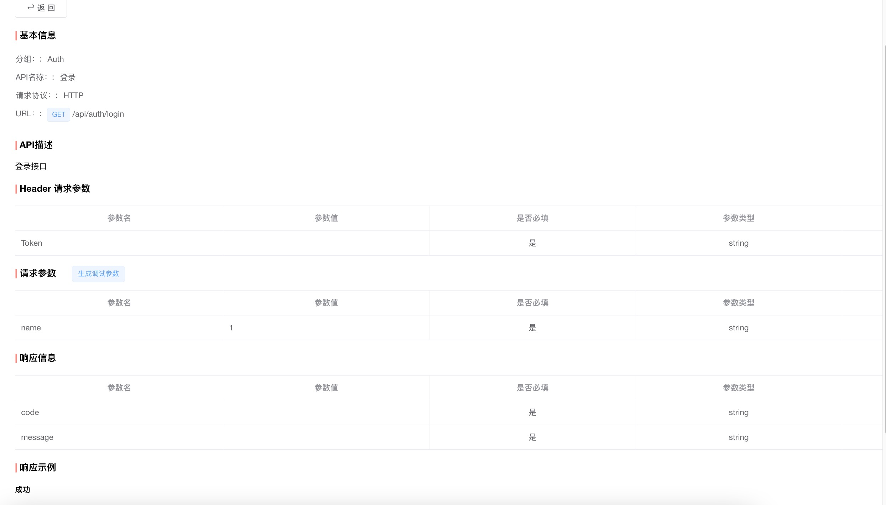

# laravel-online-document
在线文档管理

### 软件架构
- Laravel:8.75
- PHP:7.3^8.0

### 示例

### 功能列表
- Auth
    - [X] 登录 /api/auth/login
    - [X] 登录会员信息 /api/auth/me
- [X] 项目内的权限验证
- [X] 分组管理
    - [X] 列表
    - [X] 创建
    - [X] 编辑
    - [X] 批量更新分组排序与归属父级 /api/group/batch-save
    - [X] 删除 /api/group/delete
- 项目管理 
    - [X] 列表
    - [X] 详情
    - [X] 创建
    - [X] 编辑
    - [X] 删除 /api/project/delete
- API管理 
    - [X] 列表
    - [X] 详情
    - [X] 创建
    - [X] 编辑
    - [X] 删除 /api/api-delete
- 文档管理 
    - [X] 列表
    - [X] 详情
    - [X] 创建
    - [X] 编辑
    - [X] 删除 /api/doc/delete
- [X] 字段映射
    - [X] 列表
    - [ ] ~~详情~~
    - [X] 创建
    - [X] 编辑
    - [X] 删除
- [X] 项目成员
    - [X] 列表 /api/project-members
      - 必须是项目创建人与管理员
    - [ ] ~~详情~~
    - [X] 创建
      - 必须是项目创建人与管理员
    - [X] 编辑
      - 必须是项目创建人与管理员
    - [X] 删除 /api/project-member/delete
      - 必须是项目创建人与管理员
    - [X] 设置权限 /api/project-member/set-role-power
      - 必须是项目创建人与管理员
    - [ ] 设为项目管理员
      - 必须是项目创建人
- 操作日志
    - [X] 列表 /api/operation-logs
    - [ ] 记录日志
      - [X] `项目`的新增、编辑的日志
      - [X] `分组`的新增、编辑的日志
      - [X] `API`的新增、编辑的日志
      - [X] `文档`的新增、编辑的日志
      - [X] `字段映射`的新增、编辑的日志
      - [X] `成员`的新增、编辑、删除、设置权限的日志
